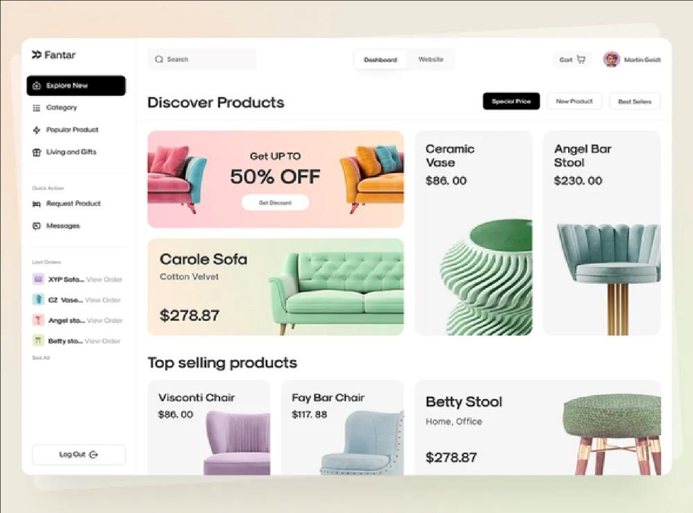
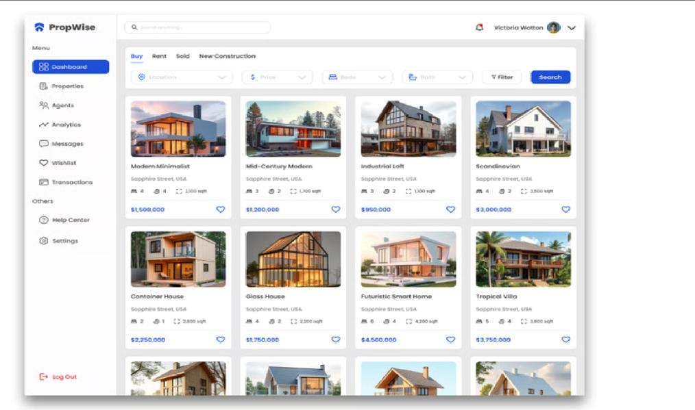

# Real Estate Web/Mobile App

A simple web/mobile application for listing and managing real estate properties, built with **Firebase Authentication** and **Firebase Firestore**.

## Overview

The app supports two types of users — **Admin** and **Regular User** — each with different permissions and views.

---

## User Roles & Permissions

### 1. Admin
- Can add, edit, and delete property listings.
- Can manage users through an **Admin Dashboard**.

### 2. Regular User
- Can browse the list of available properties (real estate).
- Can view details of each property (price, location, description, etc.).
- Can add properties to **Favorites**.

---

## Dashboard Design

The **Admin Dashboard** should be available only on wide screens (width ≥ 600px), such as desktop or tablet (landscape).

- On small screens, show a simplified view, a link, or redirect to a separate mobile-friendly page.

---

## Core Features

### 1. User Authentication
- Use **Firebase Authentication** (Email/Password) for sign-up and login.

### 2. User Roles and Permissions
- Distinguish Admin from regular users using a field in **Firestore** or **Firebase Custom Claims**.

### 3. Data Storage
- Store all property data in **Firebase Firestore** with fields such as: `title`, `type`, `location`, `price`, `description`, etc.

### 4. Property Management
- Admin can **create, update, and delete** property listings (POST/GET/UPDATE/DELETE via Firestore).
- Users can **view all listings** and open a **details page** for each property.

### 5. Admin Dashboard
- Provides tools for managing properties and user accounts.
- The choice of app design/UI is flexible.

---

## Dashboard Design References

The Admin Dashboard UI may look similar to these examples (for inspiration only — actual design is flexible):





*(Images are included locally in `assets/images/`. Make sure to register the path in `pubspec.yaml` if used inside the Flutter app.)*

---

## App Screens

- **Register / Login Screens**
- **Home Screen** – view all real estate listings
- **Details Screen** – show details of a selected property
- **Admin Dashboard** – manage properties and users (wide screens only)

---

## Tech Stack (Suggested)

| Layer | Technology |
|---|---|
| Authentication | Firebase Authentication (Email/Password) |
| State Management (Auth) | Cubit (flutter_bloc) |
| Database | Firebase Firestore |
| Frontend | Flutter (or web/mobile framework of choice) |
| Roles | Firestore user field or Firebase Custom Claims |

---

## State Management
- **Cubit** (from the `flutter_bloc` package) is used to manage the **Authentication** flow (sign-up, login, logout, auth state changes).
- Cubit states typically include: `AuthInitial`, `AuthLoading`, `AuthAuthenticated`, `AuthUnauthenticated`, `AuthError`.
- A setup video/reference is available showing how to integrate Cubit with Firebase Authentication in this project.

---

## Reference Video
- 📹 A video walkthrough covering **all the app screens/UI** (Register, Login, Home, Details, Admin Dashboard, etc.) is included locally in the project's `assets` folder.
- **Path:** `assets/videos/app_walkthrough.mp4`
- *(Adjust the file name/path above to match the actual file you place in the `assets` folder.)*
- Note: for Flutter, remember to register the assets path in `pubspec.yaml`:
  ```yaml
  flutter:
    assets:
      - assets/videos/
      - assets/images/
  ```

---

## Notes
- Responsive design is required: Admin Dashboard is desktop/tablet-only (≥600px); mobile users get a simplified/alternate experience.
- App design and UI layout are left to the developer's discretion, as long as the core features above are implemented.
